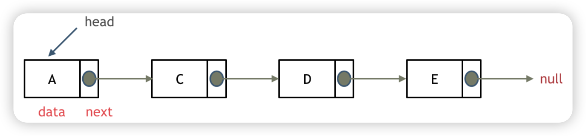
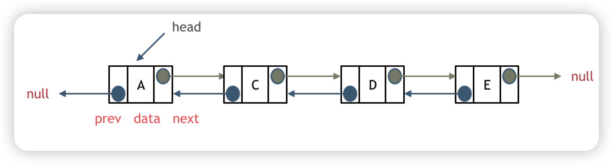
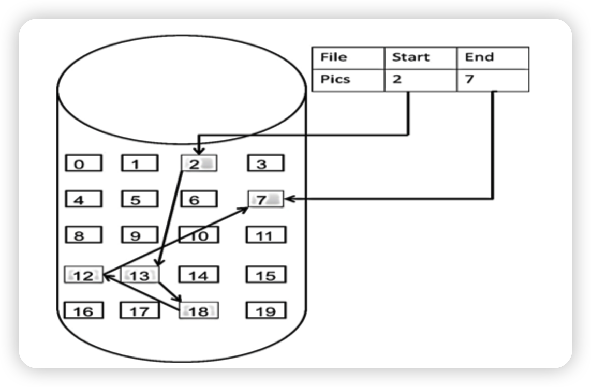

## 链表

### 理论

#### 单链表

通过指针串联在一起的线性结构，每一个节点由两部分组成，一个是数据域一个是指针域（存放指向下一个节点的指针），最后一个节点的指针域指向null（空指针的意思）。

链表的入口节点称为链表的头结点也就是head。

如上图

#### 双联表

每个节点有两个指针，一个指向下个节点，一个指向上个节点。

双联表既可以向前查询也可以向后查询



#### 循环联表

首位相连的链表

可以解决约瑟夫环问题


#### 链表存储方式

链表中的节点在内存中不是连续分布的 ，而是散乱分布在内存中的某地址上，分配机制取决于操作系统的内存管理。

#### 链表定义

```java
public class ListNode{
  int val;
  
  ListNode next;
  
  public ListNode(){
    
  }
   public ListNode(int val){
    this.val = val;
  }
   public ListNode(int val, ListNode next){
     this.val = val;
     this.next = next;
  }
}
```


### 移除链表元素

#### leetcode 203

删除链表中等于给定值 val 的所有节点。

示例 1：
输入：head = [1,2,6,3,4,5,6], val = 6
输出：[1,2,3,4,5]

示例 2：
输入：head = [], val = 1
输出：[]

示例 3：
输入：head = [7,7,7,7], val = 7
输出：[]

思路：遍历移除即可. 注意删除头节点的问题

```java
/**
 * Definition for singly-linked list.
 * public class ListNode {
 *     int val;
 *     ListNode next;
 *     ListNode() {}
 *     ListNode(int val) { this.val = val; }
 *     ListNode(int val, ListNode next) { this.val = val; this.next = next; }
 * }
 */
class Solution {
    public ListNode removeElements(ListNode head, int val) {
      //删除头节点为val的
        while(head != null && head.val == val){
            head = head.next;
        }

        if (head == null){
            return head;
        }

        ListNode pre = head;
        ListNode cur = head.next;
        while(cur != null){
            if(cur.val == val){
                pre.next = cur.next;
            }
            else{
                pre = cur;
            }
            cur = cur.next;
        }
        return head;

        
    }
}
```


### 设计链表

#### leetcode 707

在链表类中实现这些功能：

- get(index)：获取链表中第 index 个节点的值。如果索引无效，则返回-1。
- addAtHead(val)：在链表的第一个元素之前添加一个值为 val 的节点。插入后，新节点将成为链表的第一个节点。
- addAtTail(val)：将值为 val 的节点追加到链表的最后一个元素。
- addAtIndex(index,val)：在链表中的第 index 个节点之前添加值为 val 的节点。如果 index 等于链表的长度，则该节点将附加到链表的末尾。如果 index 大于链表长度，则不会插入节点。如果index小于0，则在头部插入节点。
- deleteAtIndex(index)：如果索引 index 有效，则删除链表中的第 index 个节点。

```java
//单链表
class ListNode {
    int val;
    ListNode next;
    ListNode(){}
    ListNode(int val) {
        this.val=val;
    }
}
class MyLinkedList {
    //size存储链表元素的个数
    int size;
    //虚拟头结点
    ListNode head;

    //初始化链表
    public MyLinkedList() {
        size = 0;
        head = new ListNode(0);
    }

    //获取第index个节点的数值，注意index是从0开始的，第0个节点就是头结点
    public int get(int index) {
        //如果index非法，返回-1
        if (index < 0 || index >= size) {
            return -1;
        }
        ListNode currentNode = head;
        //包含一个虚拟头节点，所以查找第 index+1 个节点
        for (int i = 0; i <= index; i++) {
            currentNode = currentNode.next;
        }
        return currentNode.val;
    }

    //在链表最前面插入一个节点，等价于在第0个元素前添加
    public void addAtHead(int val) {
        addAtIndex(0, val);
    }

    //在链表的最后插入一个节点，等价于在(末尾+1)个元素前添加
    public void addAtTail(int val) {
        addAtIndex(size, val);
    }

    // 在第 index 个节点之前插入一个新节点，例如index为0，那么新插入的节点为链表的新头节点。
    // 如果 index 等于链表的长度，则说明是新插入的节点为链表的尾结点
    // 如果 index 大于链表的长度，则返回空
    public void addAtIndex(int index, int val) {
        if (index > size) {
            return;
        }
        if (index < 0) {
            index = 0;
        }
        size++;
        //找到要插入节点的前驱
        ListNode pred = head;
        for (int i = 0; i < index; i++) {
            pred = pred.next;
        }
        ListNode toAdd = new ListNode(val);
        toAdd.next = pred.next;
        pred.next = toAdd;
    }

    //删除第index个节点
    public void deleteAtIndex(int index) {
        if (index < 0 || index >= size) {
            return;
        }
        size--;
        if (index == 0) {
            head = head.next;
	    return;
        }
        ListNode pred = head;
        for (int i = 0; i < index ; i++) {
            pred = pred.next;
        }
        pred.next = pred.next.next;
    }
}

```


### 反转链表

#### leetcode 206

反转一个单链表。

示例: 输入: 1->2->3->4->5->NULL 输出: 5->4->3->2->1->NULL

```java
class Solution {
    public ListNode reverseList(ListNode head) {
         ListNode prew = null;
       ListNode now = head;
       
       while(now != null){
           ListNode next = now.next;
           now.next = prew;
           prew = now;
           now = next;
       }
       return prew;
    }
}
```

### 两两交换链表中的节点

#### leetcode 24

给定一个链表，两两交换其中相邻的节点，并返回交换后的链表。

你不能只是单纯的改变节点内部的值，而是需要实际的进行节点交换。

思路：定义一个空节点指向头部，再定义一个current指针指向空节点。保存第一与第三节点，current指向第二节点，二指向一，一指向三，更新current到三节点前方。 循环。 终止条件： 偶数节点是current.next为空,奇数时current.next.next为空。

```java
/**
 * Definition for singly-linked list.
 * public class ListNode {
 *     int val;
 *     ListNode next;
 *     ListNode() {}
 *     ListNode(int val) { this.val = val; }
 *     ListNode(int val, ListNode next) { this.val = val; this.next = next; }
 * }
 */
class Solution {
    public ListNode swapPairs(ListNode head) {
        ListNode dummyhead = new ListNode();
        dummyhead.next = head;
        ListNode cur = dummyhead;
        ListNode temp;
        ListNode temp1;
        while(cur.next !=null && cur.next.next !=null){
            temp = cur.next;
            temp1 = cur.next.next.next;
            cur.next = cur.next.next;
            cur.next.next = temp;
            temp.next = temp1;
            cur = cur.next.next;
        }
        return dummyhead.next;
    }
}
```

